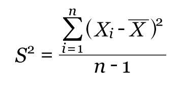

```{r setup, include=FALSE}
knitr::opts_chunk$set(echo = TRUE, message = FALSE)
```

# Título do Capítulo 

## Subtítulo 01

### Sub-subtítulo

#### subsubsubtitulo

Objetivo do trabalho foi avaliar a emissão de $CO_{2}$ e vamos estudar o $Mg^{2+}$.

Atalho para gerar o HTML `CONTROL+SHIFT+K`

```{r,out.width = "60%", fig.cap="Principais Estimadores na amostra",fig.align = 'center',echo=FALSE}

```

## Edição de Fómulas


$$
\mu \rightarrow \text{Média Amostral: } \bar{x} = \frac{\sum_{i=1}^n x_i}{n}
$$


$$
\mu \rightarrow \text{Média Amostral: } \bar{x} = \frac{\sum \limits_{i=1}^n x_i}{n} 
\\
\sigma^2 \rightarrow \text{Variância Amostral: } s^2 = \frac{ \sum_{i=1}^n (x_i - \bar{x} )^2}{n-1}
$$


Outra fórmula para a variância.

$$
s^2 = \frac{\sum \limits_{i=1}^n x_i - \frac{\left(\sum \limits_{i=1}^n x_i \right)^2}{n} }{n-1}
$$

raiz quadrada

$\sqrt{\pi*2-cos45°}$

# Introdução do Projeto
O Brasil é o maior produtor de *cana-de-açúcar* do mundo com mais de **9 milhões** de hectares em área plantada. O Estado de São Paulo é o maior produtor nacional de açúcar.


```{r,out.width = "40%", fig.cap="Programando em R",fig.align = 'center',echo=FALSE}
knitr::include_graphics("https://media.giphy.com/media/QLvTQynWRyb9XGeXRS/giphy.gif")
```

**FONTE**: [GIPHY](https://giphy.com/)

**FONTE**: [PEXELS](https://www.pexels.com/)

Vamos plotar a função $y = x^2 -5x + 6$.

para colocar o chunk, selecione `CONTROL+ALT+I`

```{r}
x <- -10:10
y <- x*x -5*x +6
plot(x,y,pch=21,col="black",bg="gray",cex=2,las=1)
```


```{r, message=FALSE}
library(tidyverse) 
```


Análise de regressão linear

```{r}
mod <- lm(y~x)
summary.lm(mod)
```

`abline(mod,col="red",lty=2,lwd=1.6)`

```{r, echo=FALSE}
x <- -10:10
y <- x*x -5*x +6
plot(x,y,pch=21,col="black",bg="gray",cex=2,las=1)
abline(mod,col="red",lty=2,lwd=1.6)
```

## Manipular o arquivo iris

```{r,eval=FALSE}
iris %>% # CONTROL + SHIFT + M
  group_by(Species) %>% 
  summarise(
    mean_Sepal_lenght = mean(Sepal.Length),
    mean_Pepal_lenght = mean(Petal.Length),
    n=n()
  )
```


## Pacote kableExtra

```{r,echo=FALSE}
library(kableExtra)
tab <- iris %>% # CONTROL + SHIFT + M
  group_by(Species) %>% 
  summarise(
    mean_Sepal_lenght = mean(Sepal.Length),
    mean_Pepal_lenght = mean(Petal.Length),
    n=n()
  )
kable(tab)
```


